<picture>
  <source media="(prefers-color-scheme: dark)" srcset="hero-dark.svg">
  <source media="(prefers-color-scheme: light)" srcset="hero-light.svg">
  
</picture>

Most of this work runs in production for real businesses, which is why the repositories are private. Happy to walk through any of it in detail.

## Running in production

**Revenue analytics platform** · `Python · DuckDB · FastAPI · Power BI`\
Ingests ten-plus sources into a single analytics model with idempotent re-ingestion, serving executive reports, dashboards, and a REST API.

**Perfume retail platform** · `Flutter · SQLite over OPFS · Cloudflare Workers`\
Inventory, costing, and sales with the database running entirely in the browser. Marketplace sync, WhatsApp order parsing, weighted-average costing with per-transaction FX.

**Tennis club management** · `React · Supabase · IndexedDB`\
Offline-first: writes queue locally, retry with backoff, and surface real conflicts to the user. Row-level security and a full audit log.

**Association treasury** · `React · Supabase · PWA`\
Membership, dues, receipts, and a multi-currency cash box. Multi-table writes are atomic Postgres RPCs.

**Restaurant POS + ETL** · `Python · SQL Server · Power BI`\
A POS with thermal printing and auto-updates, feeding a Bronze → Silver → Gold pipeline that unifies three delivery channels into one margin model. It found the losing promotions and drove a pricing restructure.

## Defaults

- Idempotent by default: re-runs never duplicate data.
- Offline-first where connectivity can't be trusted.
- Money math in decimals, with exchange rates captured at transaction time.
- Security at the database layer, not just the UI.

## Background

Economics at UNC, teaching its statistics courses since 2020. Research on machine learning for credit risk and on the Argentine economy. The numbers behind my dashboards get the same care as the code.

## Toolbox

**Data** · Python · SQL (PostgreSQL, SQL Server, SQLite) · DuckDB · Power BI · Looker Studio · BigQuery\
**Software** · TypeScript · React · Next.js · Flutter · Supabase · Cloudflare Workers\
**AI & ML** · Anthropic & Gemini APIs · scikit-learn · XGBoost · R\
**Delivery** · GitHub Actions · Sentry · Vercel

 

Córdoba, Argentina · UTC-3 · <a href="mailto:lucio.porce@gmail.com">lucio.porce@gmail.com</a>
